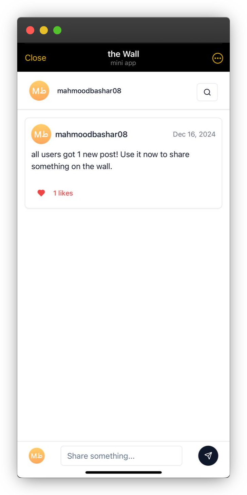
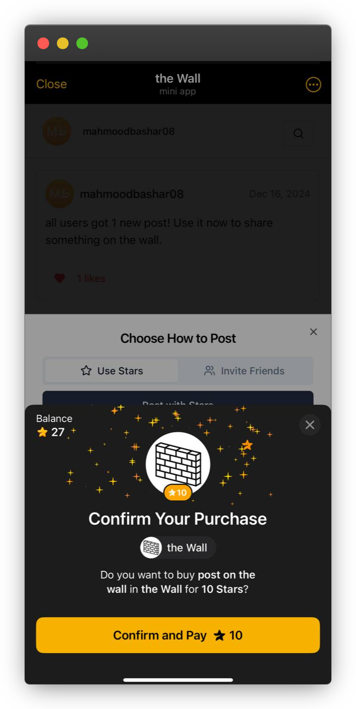
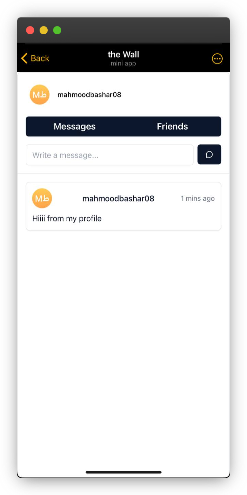
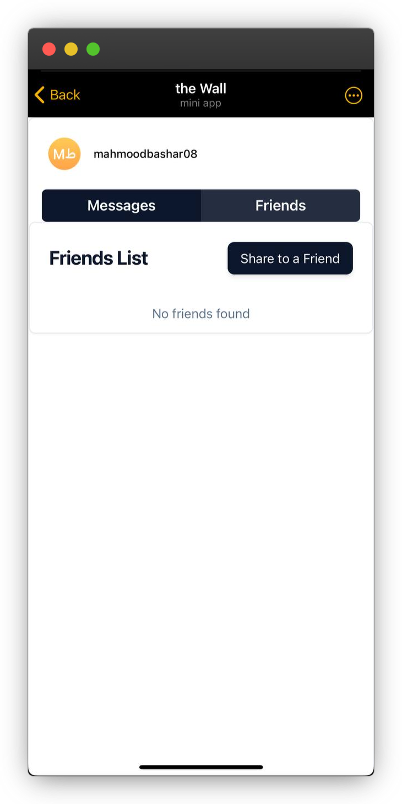

# The Wall

The Wall is a unique social platform where users can post messages on a shared wall. Each user has an independent wall and can make posts by either purchasing 10 Telegram Stars or inviting 5 friends.

## Features
- A public wall displaying the latest 100 posts
- User-specific walls for personal posting
- Post access via Telegram Stars or friend invites
- Built with React.js, NestJS, and Telegram Mini Apps

## Project Screenshots

Here are some visuals of The Wall in action:

## Technologies Used
- **Frontend:** React.js (TypeScript)
- **Backend:** NestJS
- **Database:** MySQL (MariaDB)
- **Telegram Integration:** Telegram Mini Apps & Telegram Stars

## How It Works
1. Users can post messages on the wall.
2. The wall only displays the latest 100 posts.
3. Posting requires either 10 Telegram Stars or inviting 5 friends.
4. Each user has their own independent wall.

## License
This project is licensed under the MIT License.
